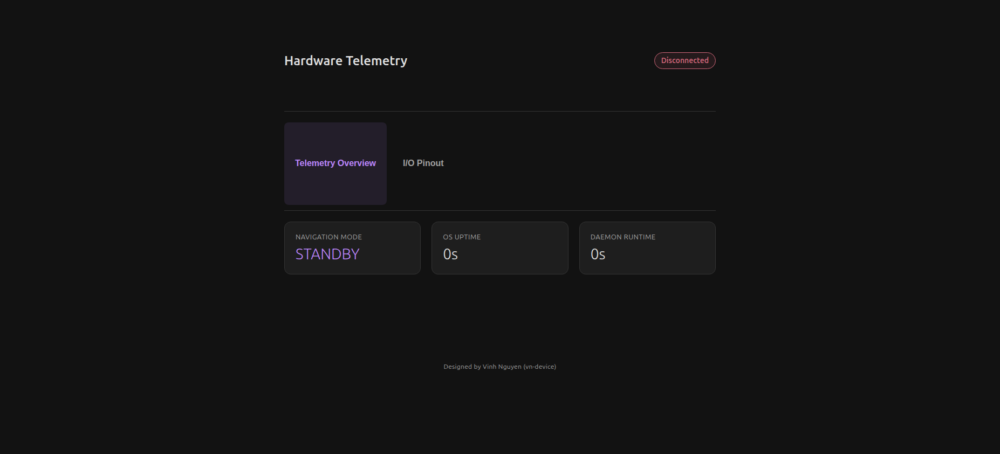
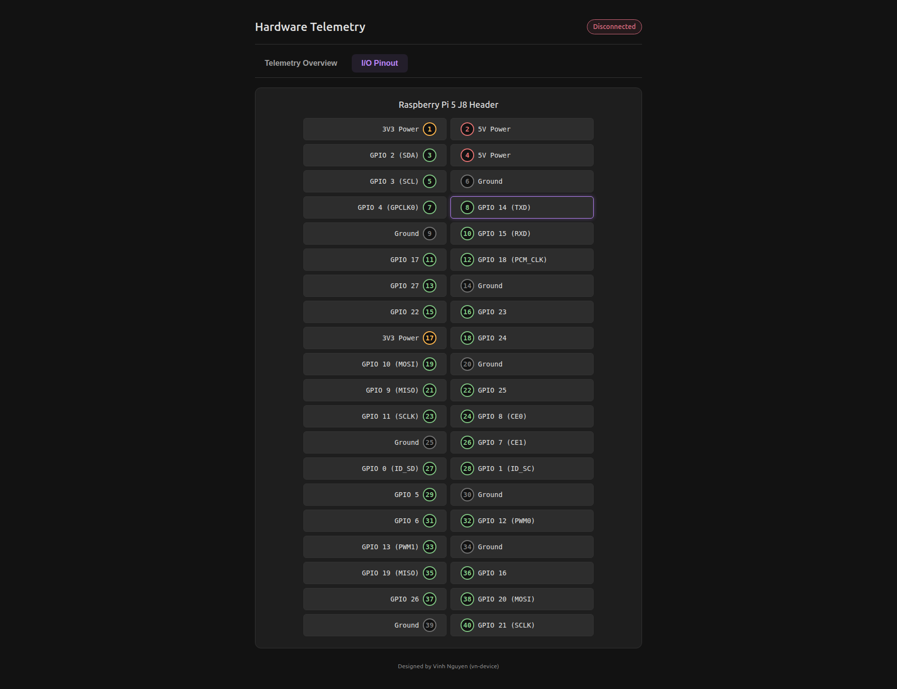

# meta-telemetry: Yocto Layer for Raspberry Pi 5 WebSocket Telemetry

A custom Yocto Project meta-layer deploying a Qt6 C++ daemon and a lightweight web presentation layer to surface real-time hardware status and I/O control over persistent WebSockets.

## ⚙️ Systems Architecture & Data Plane

This layer establishes a strictly decoupled, event-driven telemetry pipeline optimized for low-latency embedded monitoring:

`Browser Client (dashboard.html) <--> WebSockets (Port 8080) <--> Qt6 C++ Daemon <--> Physical Layer (40-Pin Header)`

* **Event-Driven IPC:** Replaces heavy polling with an asynchronous WebSocket server running on port 8080. Telemetry and state updates are exchanged via JSON frames.
* **Decoupled Presentation:** A Lighttpd web server delivers a responsive CSS Grid dashboard. The client automatically binds to the WebSocket bridge using dynamic host resolution.
* **Hardware Interactivity:** Implements a bi-directional command protocol, allowing the dashboard to monitor and actuate pins across the full 40-pin GPIO header.

## 🛠️ Tech Stack

* **Build System:** Yocto Project, BitBake (`core-image-minimal`)
* **Hardware Target:** Raspberry Pi 5 (`aarch64`)
* **Backend:** C++17, Qt6 Core/Network
* **Web Serving:** Lighttpd (Optimized for static assets)
* **Frontend:** HTML5, CSS3, native JavaScript ES6 WebSockets
* **Process Management:** systemd

## 🚀 Build and Deployment Instructions

**1. Clone the Layer**
Navigate to your Yocto `sources/` directory and pull this repository:
```bash
cd ~/rpi-yocto/sources/
git clone https://github.com/vn-device/meta-telemetry.git
```

## 📺 Interface Previews

| Telemetry Overview | I/O Pinout View |
| :--- | :--- |
|  |  |